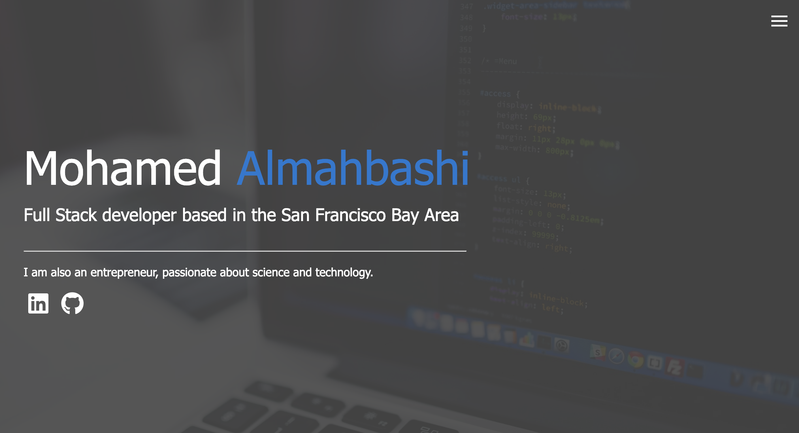
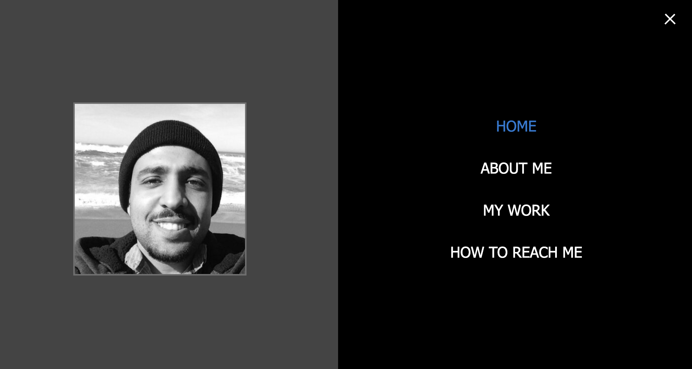
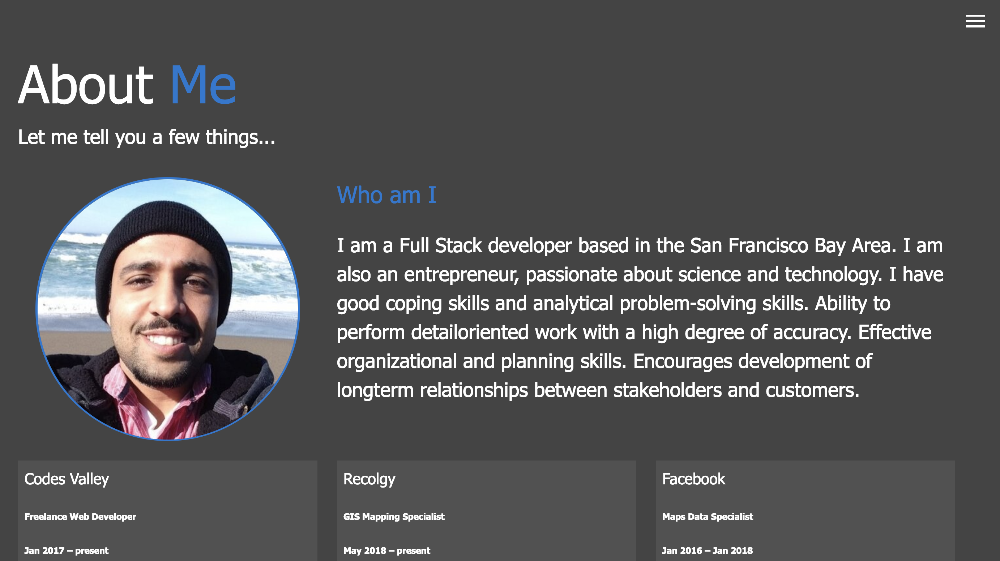
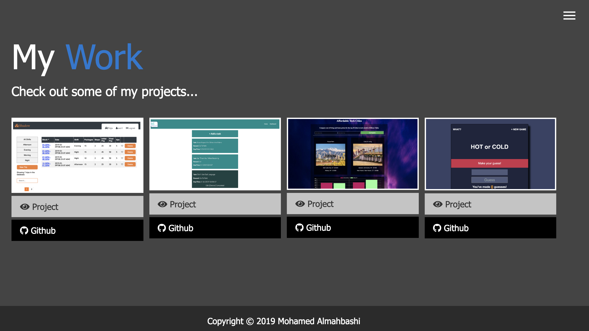

## My Protfolio Website

My protfolio website show some of the projects I built and technologies I used to build them 

## Live Website
- [Almahbashi.io](http://almahbashi.io/)
- [Github Repo](https://github.com/mohawow/shadow)

## App Screenshots
<h2 align="center">LandingPage </h2>

<h2 align="center">Nav Bar</h2>

<h2 align="center">About me </h2>

<h2 align="center">Some of my work </h2>

